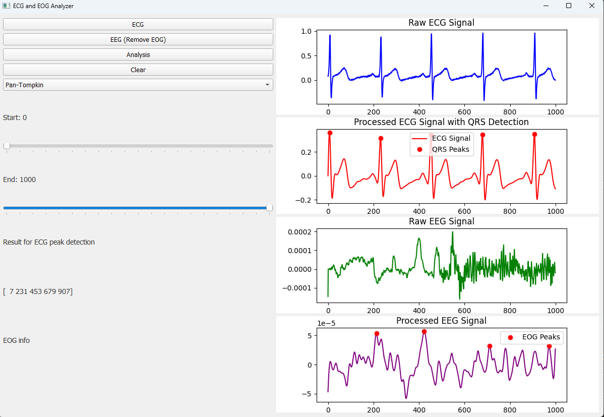

# ECG and EEG Signal Analyzer

This project is a comprehensive ECG (Electrocardiogram) and EEG (Electroencephalogram) signal analysis tool designed with a user-friendly graphical interface using PyQt5 and powerful backend processing with libraries like NumPy, SciPy, WFDB, and MNE. The tool is capable of loading, visualizing, and analyzing ECG and EEG signals, with specific functionality for detecting QRS complexes in ECG signals and removing EOG artifacts from EEG signals.

## Features

- **Load and Visualize ECG Signals**: Load ECG data files, visualize raw ECG signals, and perform QRS complex detection using multiple methods.
- **Load and Visualize EEG Signals**: Load EEG data files, visualize raw EEG signals, and remove EOG artifacts to clean the EEG signals.
- **Signal Processing Methods**:
  - **QRS Detection**: Implements Pan-Tompkins, Correlation, and Detrending methods for detecting QRS complexes in ECG signals.
  - **EOG Artifact Removal**: Identifies and removes EOG channels from EEG data for cleaner signal analysis.
- **Interactive GUI**: 
  - Control the start and end time of the signal segment for analysis using sliders.
  - Select the desired QRS detection method from a dropdown menu.
  - Display the results of ECG peak detection and EOG artifact removal.
- **Real-Time Updates**: Update visualizations and analysis results interactively based on user input.

## GUI Components

- **Buttons**:
  - `ECG`: Load and visualize ECG files.
  - `EEG (Remove EOG)`: Load and visualize EEG files, removing EOG artifacts.
  - `Analysis`: Perform analysis on the loaded signals.
  - `Clear`: Clear all plots and results.
- **Dropdown Menu**: Select the QRS detection method (Pan-Tompkins, Correlation, Detrending).
- **Sliders**: Adjust the start and end time of the signal segment for analysis.
- **Labels**: Display results of ECG peak detection and EOG artifact removal.
- **Plot Canvases**: Visualize raw and processed ECG and EEG signals.

## Code Structure

The project is implemented in Python and organized as follows:

- **MainWindow Class**: 
  - Initializes the GUI.
  - Handles loading and visualizing ECG and EEG files.
  - Implements signal processing methods.
  - Updates the GUI based on user interaction.
- **Helper Methods**:
  - `load_ecg_file()`: Loads ECG files and visualizes raw signals.
  - `load_eeg_file()`: Loads EEG files, removes EOG artifacts, and visualizes raw signals.
  - `plot_signal()`: Plots signal data on the specified canvas.
  - `analyze_signals()`: Performs analysis on the loaded signals.
  - `preprocess_signal()`: Applies detrending and filtering to the signal.
  - `detect_qrs()`: Detects QRS complexes in the ECG signal using simple logic.
  - `plot_signal_with_qrs()`: Plots ECG signal with detected QRS peaks.
  - `clear_plots()`: Clears all plots and results.
  - `update_start_label()`: Updates the start time label based on slider value.
  - `update_end_label()`: Updates the end time label based on slider value.
  - `pan_tompkins()`: Implements the Pan-Tompkins algorithm for QRS detection.
  - `detect_r_peaks_by_correlation()`: Detects R-peaks using correlation method.
  - `detect_r_peaks_by_detrending()`: Detects R-peaks using detrending method.

## Getting Started

### Prerequisites

- Python 3.x
- Required Python libraries: numpy, scipy, matplotlib, PyQt5, wfdb, mne

### Installation

1. Clone the repository:
   ```bash
   git clone https://github.com/your-username/ecg-and-eeg-analyzer.git
   cd ecg-eeg-signal-analyzer
   ```

2. Install the required libraries:
   ```bash
   pip install numpy scipy matplotlib pyqt5 wfdb mne
   ```

3. Run the application:
   ```bash
   python AppFinal_ECG_EOG_Analyzer.py
   ```

## Usage

1. Click the `ECG` button to load and visualize an ECG file.
2. Click the `EEG (Remove EOG)` button to load and visualize an EEG file.
3. Select the desired QRS detection method from the dropdown menu.
4. Adjust the start and end time sliders to select the signal segment for analysis.
5. Click the `Analysis` button to perform the signal analysis and display the results.
6. Click the `Clear` button to reset the plots and results.

## Contributing

Contributions are welcome! Please feel free to submit a Pull Request.

## Dataset


## Example output


## Acknowledgements

- The PyQt5 library for the GUI framework.
- The NumPy and SciPy libraries for numerical operations and signal processing.
- The WFDB library for ECG file handling.
- The MNE library for EEG file handling and processing.
